<div align="center">
  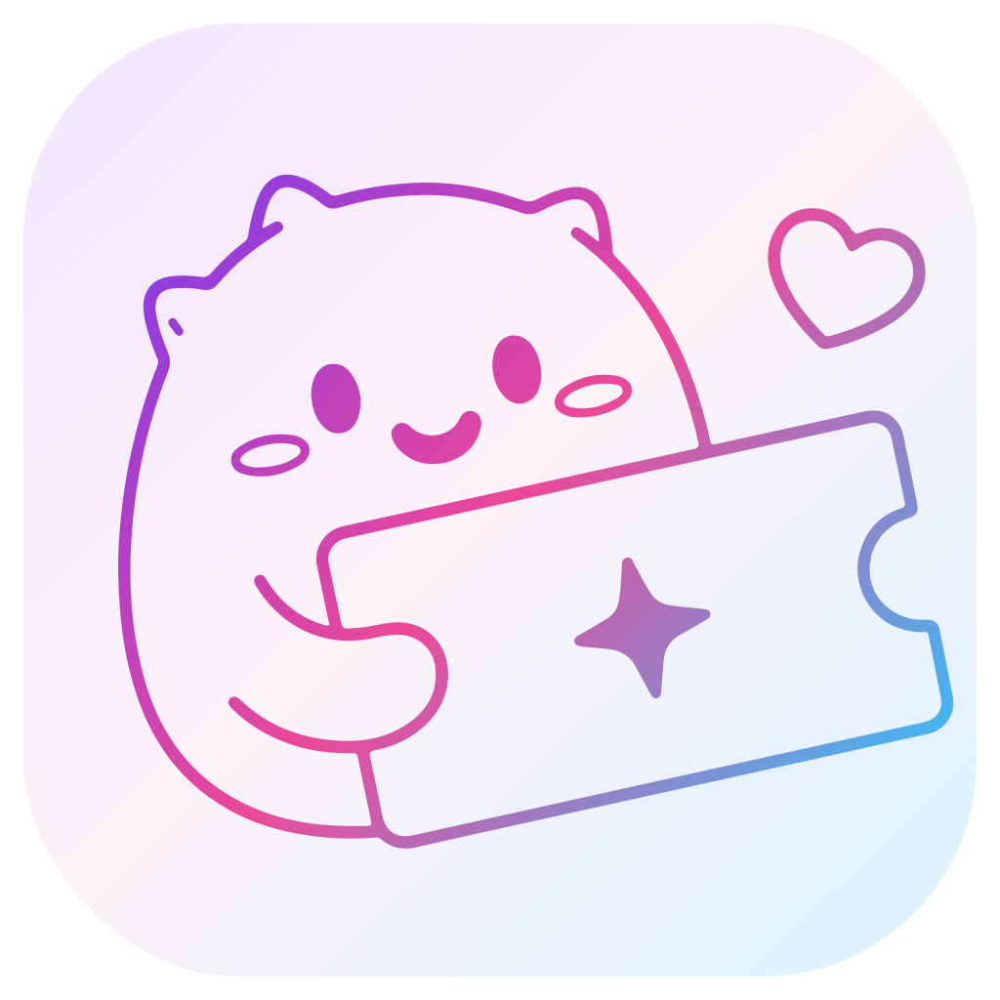

  <h1>TiKi</h1>

  <p><i>티켓팅의 설렘이 공연이 끝난 뒤에도 오래 남도록</i></p>

  <p>
    소규모 공연 기획자, 프리랜서 강사, 로컬 이벤트 주최자 등<br />
    대형 플랫폼 입점이 어려운 판매자를 위한 예약형 티켓 오픈마켓입니다.
  </p>

  <p><sub>멋쟁이사자처럼 프론트엔드 부트캠프 17기 파이널 프로젝트</sub></p>

  <p>
    <a href="https://tiki-final.vercel.app">
      
    </a>
  </p>

  <p>
    
    
    
    
    
    
  </p>
</div>

---

## 목차

- [프로젝트 소개](#프로젝트-소개)
- [기술 스택](#기술-스택)
- [팀원 소개](#팀원-소개)
- [주요 기능](#주요-기능)
- [데모 · 스크린샷](#데모--스크린샷)
- [서비스 흐름](#서비스-흐름)
- [실행 방법](#실행-방법)
- [문서](#문서)
- [Git 컨벤션](#git-컨벤션)

---

## 프로젝트 소개

TiKi는 대형 플랫폼에 입점하기 어려운 소규모 공연 기획자, 프리랜서 강사, 로컬 이벤트 주최자를 위한 예약형 티켓 오픈마켓입니다. 판매자가 공연·클래스·전시·팬미팅 같은 일정 기반 상품을 직접 등록해 팔고, 구매자는 원하는 날짜와 좌석을 골라 예매합니다.

예매하면 QR 티켓이 발급되고, 친구에게 티켓을 나눠줄 수 있습니다. 공연을 본 뒤에는 라이브러리에 기록이 남고 리뷰를 쓸 수 있습니다.

### 핵심 가치

| 🤝 친구 | 🎁 공유 | 📚 기록 |
| :---: | :---: | :---: |
| 함께 볼 친구와 연결 | 예매한 티켓을 친구에게 전달 | 관람 공연과 후기를 라이브러리에 보관 |

### 기획 배경

대부분의 티켓 서비스는 대형 공연 예매에 맞춰져 있어서, 소규모 공연은 정보가 여기저기 흩어져 찾기 어려웠습니다. 예매한 다음도 마찬가지였습니다. 친구에게 티켓을 줄 때는 캡처를 보내야 했고, 공연이 끝나면 어떤 공연을 봤는지 기록이 남지 않았습니다.

판매자 쪽도 일정·회차·좌석이 있는 티켓을 직접 등록하고 예매자와 잔여석을 관리할 마땅한 도구가 없었습니다. 그래서 공연을 찾는 구매자와 직접 티켓을 파는 소규모 주최자를 함께 놓고, 탐색부터 예매·공유·관람·기록까지를 한 서비스로 묶었습니다.

```text
티켓(상품) 등록
  -> 날짜/시간 슬롯 선택
  -> 예매(주문)
  -> QR 발급
  -> 친구에게 티켓 공유
  -> 입장
  -> 라이브러리 기록
```

| 항목 | 내용 |
| --- | --- |
| 프로젝트명 | `TiKi` |
| 소속 | `멋쟁이사자처럼 프론트엔드 부트캠프 17기` 파이널 프로젝트 |
| 기간 | `2026.05.28 ~ 2026.07.08` |
| 발표일 | `2026.07.08` |
| 스택 | `Next.js + TypeScript + Supabase` |
| 주요 도메인 | `티켓 예매`, `좌석 선택`, `판매자 이벤트 관리`, `관리자 운영` |

<br />

## 기술 스택

<table>
  <tr>
    <td><b>Framework</b></td>
    <td>
      
      
    </td>
  </tr>
  <tr>
    <td><b>Language</b></td>
    <td>
      
    </td>
  </tr>
  <tr>
    <td><b>Styling</b></td>
    <td>
      
      
      
    </td>
  </tr>
  <tr>
    <td><b>Backend / DB</b></td>
    <td>
      
      
    </td>
  </tr>
  <tr>
    <td><b>External</b></td>
    <td>
      
      
    </td>
  </tr>
  <tr>
    <td><b>Test</b></td>
    <td>
      
      
    </td>
  </tr>
  <tr>
    <td><b>Deploy · 협업</b></td>
    <td>
      
      
      
      
    </td>
  </tr>
  <tr>
    <td><b>Tooling</b></td>
    <td>
      
      
    </td>
  </tr>
</table>

주요 라이브러리

| 라이브러리 | 용도 |
| --- | --- |
| `@supabase/ssr`, `@supabase/supabase-js` | 인증 · DB · Storage · RPC 연동 (SSR 지원) |
| `@portone/browser-sdk`, `@portone/server-sdk` | PortOne V2 결제 요청 및 서버 검증 |
| `@dnd-kit/*` | 좌석 배치도 드래그 앤 드롭 편집 |
| `sharp` | 이미지 서버 사이드 WebP 변환 · 리사이즈 |
| `@yudiel/react-qr-scanner`, `qrcode.react` | QR 티켓 발급 및 입장 스캔 |
| `recharts` | 판매자 대시보드 · 정산 통계 차트 |
| `react-daum-postcode` | 주소 검색 (스토어/배송지) |
| `sonner` | 토스트 알림 |
| `class-variance-authority`, `clsx`, `tailwind-merge` | 스타일 변형 관리 및 클래스 병합 |
| `nanoid` | 업로드 파일명 · 코드 생성 |

<details>
<summary><b>기술 스택 선정 이유</b></summary>

<br/>

**Next.js**

결제 검증, 이미지 변환, 권한별 라우팅처럼 클라이언트에서만 처리하기 어려운 로직이 많았습니다. 서버 컴포넌트, Route Handler, 미들웨어를 한 프로젝트 안에서 함께 사용할 수 있어 구매자·판매자·관리자·스태프 흐름을 역할별로 분리하기에 적합하다고 판단했습니다.

**TypeScript**

주문 상태가 회차, 좌석, 티켓 등급, 정산, 리뷰까지 이어지는 구조라 상태값이나 필드명 오류를 빠르게 잡는 것이 중요했습니다. Supabase DB 타입을 화면과 서버 로직에 함께 적용해 스키마 변경 시 컴파일 단계에서 문제를 확인할 수 있도록 했습니다.

**Supabase**

제한된 프로젝트 기간 안에서 인증, DB, Storage, 권한 정책을 함께 구성해야 했습니다. RLS를 통해 데이터 접근 권한을 DB 레벨에서 제어할 수 있고, 예매·취소처럼 동시성이 중요한 로직은 RPC로 원자적으로 처리할 수 있어 선택했습니다.

**Tailwind CSS**

여러 명이 각자 다른 화면을 개발하는 상황에서 색상, 간격, 반응형 기준을 일관되게 맞추는 것이 필요했습니다. 유틸리티 클래스와 디자인 토큰을 함께 사용해 화면별 UI 편차를 줄이고, 다크모드도 같은 기준으로 확장할 수 있도록 했습니다.

</details>

<br />

## 팀원 소개

<table>
  <tr>
    <td align="center" width="25%">
      <b>강재훈</b><br/>
      <sub>Team Leader</sub>
    </td>
    <td align="center" width="25%">
      <b>김연수</b><br/>
      <sub>Team Member</sub>
    </td>
    <td align="center" width="25%">
      <b>방효진</b><br/>
      <sub>Team Member</sub>
    </td>
    <td align="center" width="25%">
      <b>이선우</b><br/>
      <sub>Team Member</sub>
    </td>
  </tr>
  <tr>
    <td valign="top" width="25%">
      <b>탐색 · 카테고리</b><br/>
      이벤트 필터·정렬 컴포넌트, 카테고리별 이벤트 목록, 랭킹/오픈 페이지 흐름 구성<br/><br/>
      <b>이벤트 상세</b><br/>
      이벤트 상세 페이지 구조, 공연 정보·상세 이미지·리뷰·예매 영역 화면 구성<br/><br/>
      <b>관리자 · 판매자</b><br/>
      관리자 페이지 기본 구조, 판매자 매출 그래프 컴포넌트, 정산 화면 보완<br/><br/>
      <b>시스템 보완</b><br/>
      알림 시스템 리팩토링(링크 추가·디자인 개선), 결제 흐름 보완, 운영 화면 QA
    </td>
    <td valign="top" width="25%">
      <b>마이페이지</b><br/>
      프로필·예매내역·라이브러리·친구 관리·알림 화면, Supabase 연동과 사용자 데이터 흐름 구현<br/><br/>
      <b>티켓 · 체크인</b><br/>
      티켓 공유·회수, 수량 검증, QR 서명 토큰 발급·검증, 공연 입장 체크인 시스템 설계<br/><br/>
      <b>스태프 · 문의</b><br/>
      스태프 role 시스템, 공연별 초대·배정·체크인, 1:1 문의·고객센터·관리자 답변 기능<br/><br/>
      <b>공통 기반</b><br/>
      Sidebar·Input·Toggle 등 공통 컴포넌트, 레포 초기 세팅, CI 파이프라인 구성
    </td>
    <td valign="top" width="25%">
      <b>판매자 페이지</b><br/>
      이벤트 등록·관리·수정, 예매 관리(페이지네이션·필터·CSV), 매출·정산, 스토어 정보, 정산 신청 중복 방어<br/><br/>
      <b>주문 · 이미지</b><br/>
      판매자 API 인증 가드 공통화, 주문 생성·취소 RPC, 서버 이미지 파이프라인(sharp·WebP 변환·검증)<br/><br/>
      <b>리뷰 · 화면 개선</b><br/>
      리뷰 작성·수정·삭제·좋아요, 판매자 리뷰 관리, 홈·카테고리·이벤트 상세·정책 페이지 개선<br/><br/>
      <b>공통 UI · 품질</b><br/>
      모달·역할별 헤더·별점·검색바·EmptyState, 다크모드·디자인 토큰·SEO·테스트 기반 정비
    </td>
    <td valign="top" width="25%">
      <b>디자인 시스템</b><br/>
      Button·Toast·Spinner 등 초기 공통 컴포넌트 제작, 사용자 피드백 UI 기반 구성<br/><br/>
      <b>인증</b><br/>
      Supabase client, 세션 갱신 미들웨어, 회원가입 Context/Provider, 로그인 서버액션, 인증 가드 구현<br/><br/>
      <b>홈</b><br/>
      히어로 배너, 랭킹/티켓오픈/카테고리 섹션, 카드 공통 컴포넌트화, 홈 500 이슈 제거<br/><br/>
      <b>결제 · 좌석</b><br/>
      결제 페이지·간편결제·승인검증 API, 좌석 DB 스키마, 배치도 빌더, 좌석선택 모달·주문 상태 보완
    </td>
  </tr>
</table>

## 주요 기능

역할별 기능 목록입니다. 도메인별 상세와 기술 포인트는 위키에 따로 정리했습니다.

| 구분 | 기능 |
| --- | --- |
| 홈 | 히어로 슬라이더, 티켓 오픈 섹션, 예매 랭킹, 추천 이벤트, 베스트 리뷰, 카테고리별 이벤트 목록 |
| 이벤트 탐색 | 통합 검색, 최근 검색어, 카테고리별 조회, 카테고리 랭킹, 무한 스크롤 |
| 이벤트 상세 | 공연 정보·상세 이미지, 카카오맵 장소 확인, 회차 선택, 좌석/등급 선택, 리뷰 조회·작성, SEO·동적 OG |
| 예매 / 결제 | 좌석 배치도 기반 좌석 선택, 등급/수량 예매, PortOne V2 결제, 서버 결제 검증, 예매 취소·재고 복구 |
| 티켓 / 소셜 | 친구 요청·목록, 티켓 공유·회수, QR 티켓, 알림, 관람 라이브러리·리뷰 |
| 마이페이지 | 예매 내역, 공연 라이브러리(월간 캘린더), 친구 관리, 프로필·아바타, 1:1 문의 |
| 판매자 | 대시보드·매출 차트, 이벤트 등록/수정, 좌석 배치도 빌더, 예매 관리(CSV), 리뷰 관리, 정산 |
| 스태프 | 공연별 배정, 모바일 QR 체크인 |
| 관리자 | 회원·이벤트·카테고리 관리, 1:1 문의 답변, 공지/알림 관리, 통계 대시보드 |

→ [주요 기능 상세 (Wiki)](https://github.com/FRONTENDBOOTCAMP-17th/tiki/wiki/주요-기능-상세)

## 데모 · 스크린샷

<div align="center">

### 🔗 [tiki-final.vercel.app](https://tiki-final.vercel.app)

</div>

배포 환경 기준으로 캡처한 주요 화면입니다. 구매자·판매자·관리자 흐름을 나누어 확인할 수 있고, 홈 화면은 데스크탑과 모바일 반응형을 함께 담았습니다.

### 홈 · 탐색

| 데스크탑 홈 | 모바일 홈 |
| --- | --- |
| 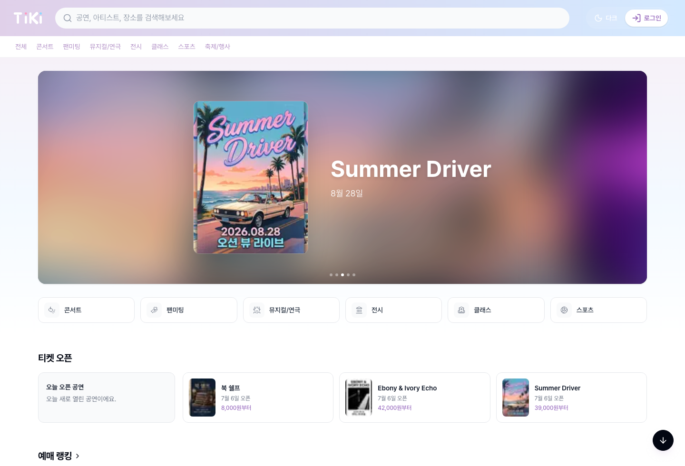 | 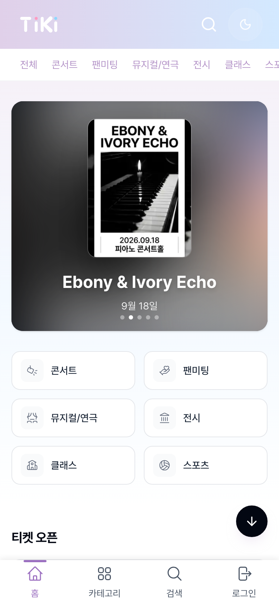 |
| 히어로 슬라이더, 카테고리 바로가기, 티켓 오픈, 예매 랭킹으로 이어지는 메인 탐색 화면입니다. | 모바일에서는 상단 검색·카테고리·하단 네비게이션을 중심으로 재배치되어 작은 화면에서도 주요 탐색 흐름을 유지합니다. |

| 검색 | 이벤트 상세 |
| --- | --- |
| 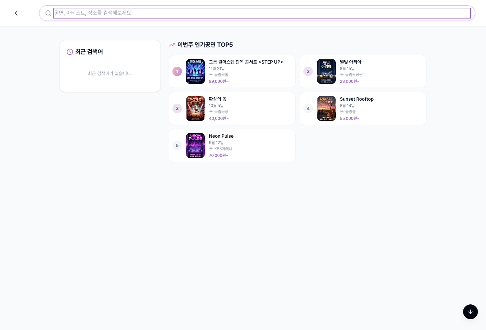 | 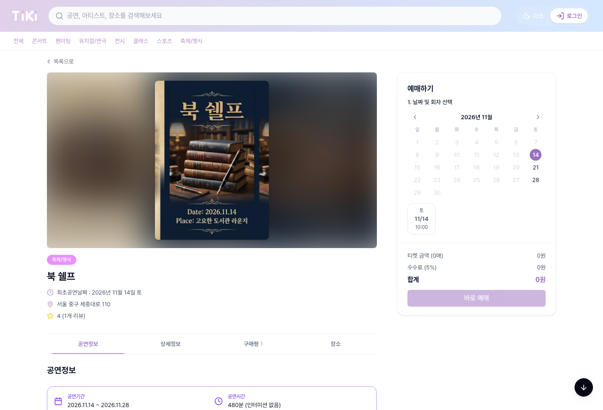 |
| 최근 검색어와 인기 공연을 함께 보여주어 검색 전에도 탐색할 수 있도록 구성했습니다. | 포스터, 공연 정보, 장소, 리뷰 탭, 날짜/회차 선택 예매 박스를 한 화면에서 확인할 수 있습니다. |

### 구매자 화면

| 예매 내역 | 라이브러리 |
| --- | --- |
| 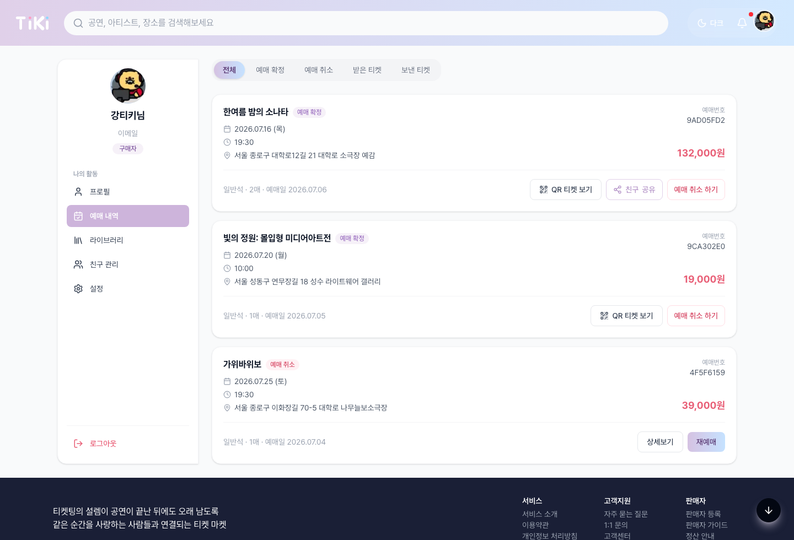 | 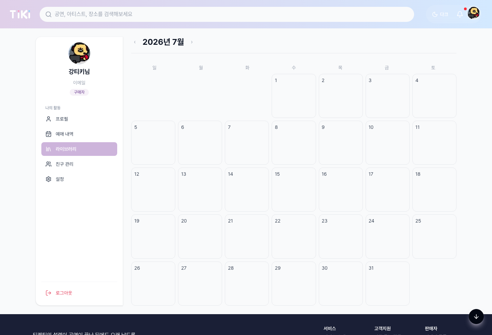 |
| 예매 상태별 필터로 확정·취소·받은 티켓·보낸 티켓을 나누어 확인하는 화면입니다. | 관람한 공연을 월간 캘린더 형태로 모아보고, 공연 경험이 기록으로 남도록 구성했습니다. |

### 판매자 · 관리자 화면

| 판매자 대시보드 | 판매자 예매 관리 |
| --- | --- |
| 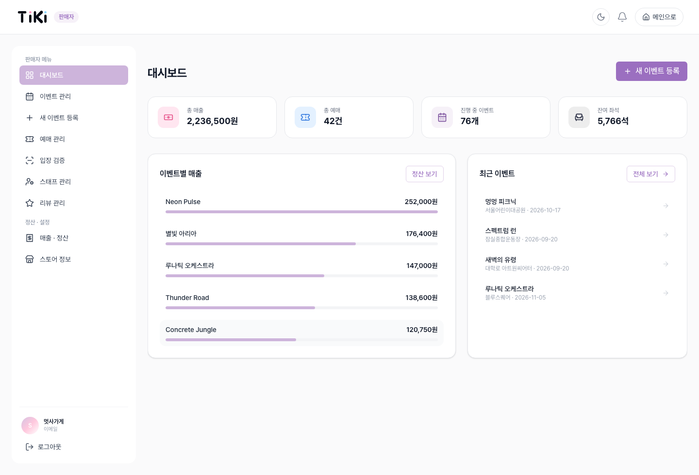 | 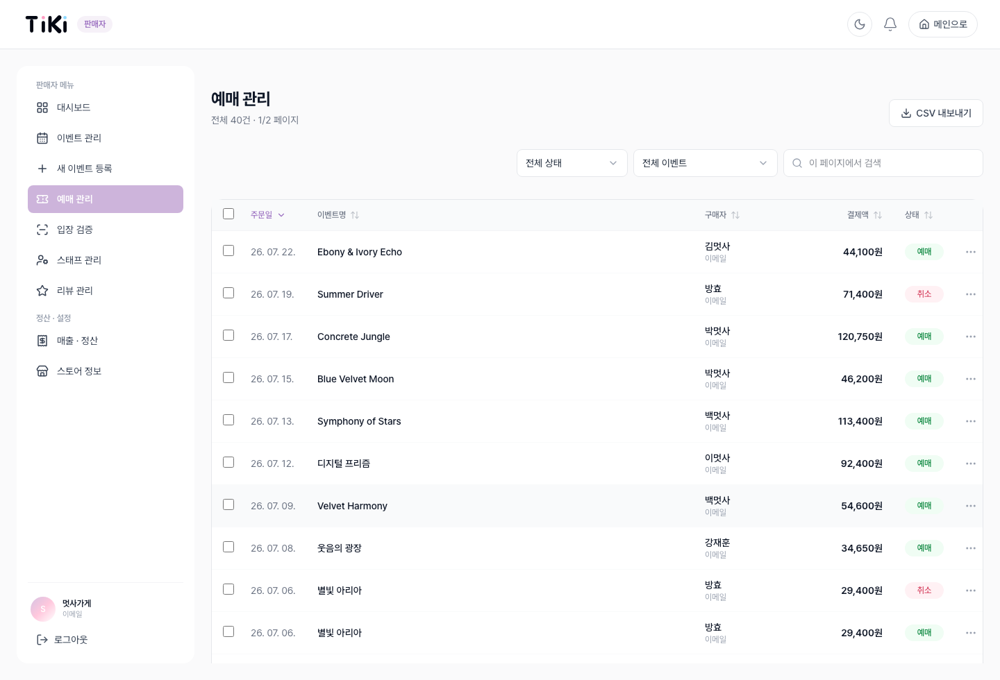 |
| 판매자가 이벤트, 예매, 매출 현황을 빠르게 확인하고 주요 관리 메뉴로 이동하는 화면입니다. | 예매 목록을 상태·이벤트별로 필터링하고, 검색·정렬·CSV 내보내기로 운영 데이터를 관리합니다. |

| 관리자 대시보드 |
| --- |
| 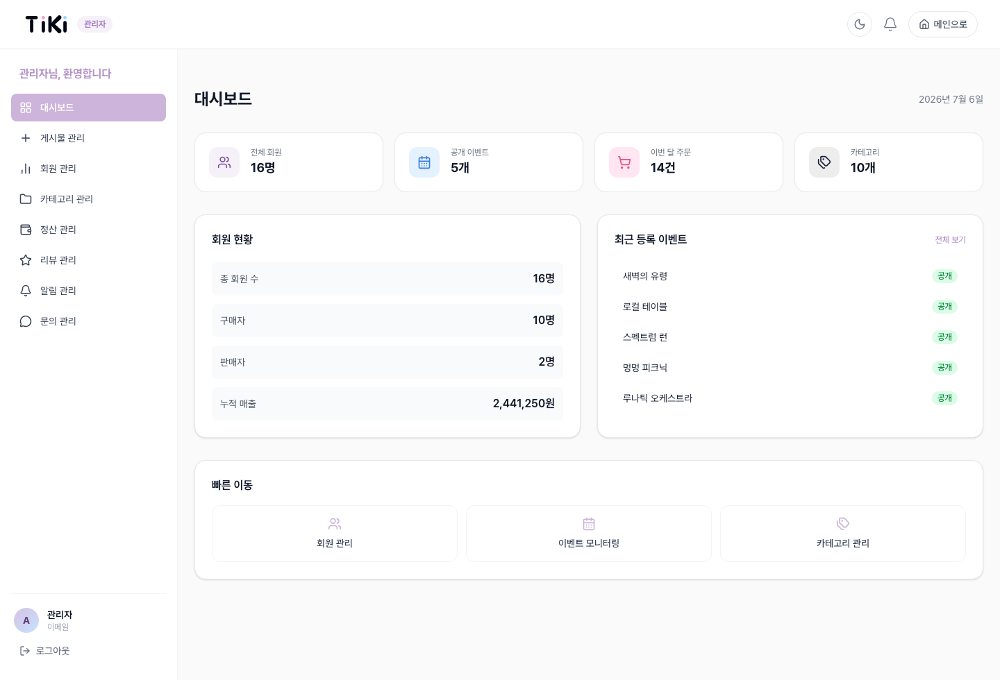 |
| 회원, 이벤트, 주문, 카테고리 현황을 한눈에 확인하고 운영 메뉴로 이동하는 관리자 첫 화면입니다. |

## 서비스 흐름

구매자, 판매자, 스태프, 관리자 네 역할이 하나의 흐름으로 이어집니다.

<div align="center">
  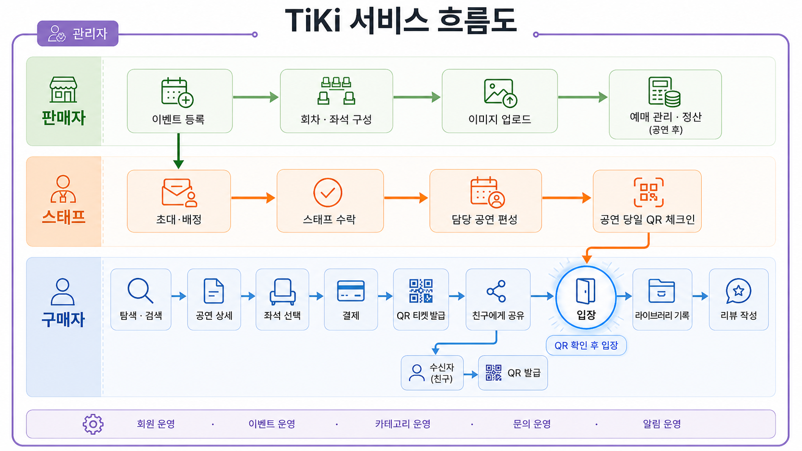
</div>

- 스태프는 판매자가 공연별로 초대·배정하고, 초대를 수락하면 담당 공연에 편성됩니다. 배정된 공연만 모바일에서 체크인할 수 있습니다 (`event_staff` 권한 가드).
- 입장 검증은 QR 토큰과 8자리 백업 코드 두 방식을 쓰고, 스태프와 판매자가 같은 체크인 화면을 공유합니다. 실제 체크인은 DB에서 원자적으로 처리합니다.
- 결제는 PortOne V2로 요청하고 서버에서 다시 검증합니다. 취소나 실패 시 주문 상태와 재고를 되돌립니다.
- 이미지는 업로드할 때 서버에서 WebP로 변환·검증한 뒤 Storage에 저장합니다.

## 실행 방법

```bash
npm install
npm run dev
```

빌드와 린트:

```bash
npm run build
npm run lint
```

테스트:

```bash
npm run test       # Vitest 단위 테스트
npm run test:e2e   # Playwright E2E 테스트
```

환경 변수는 `.env.example`을 복사해 `.env.local`에 작성합니다.

```bash
cp .env.example .env.local
```

## 문서

프로젝트 상세 문서는 **[GitHub Wiki](https://github.com/FRONTENDBOOTCAMP-17th/tiki/wiki)** 에 정리되어 있습니다.

| 문서 | 내용 |
| --- | --- |
| [주요 기능 상세](https://github.com/FRONTENDBOOTCAMP-17th/tiki/wiki/주요-기능-상세) | 도메인별 핵심 기능과 기술 포인트 |
| [트러블슈팅](https://github.com/FRONTENDBOOTCAMP-17th/tiki/wiki/트러블슈팅) | 문제 → 원인 → 해결 → 배운 점 (QR HMAC, 결제 취소 3중 방어, 좌석 동시성, 검색 race condition 등) |
| [페이지 구성](https://github.com/FRONTENDBOOTCAMP-17th/tiki/wiki/페이지-구성) | 전체 라우트 경로와 설명 |
| [폴더 구조](https://github.com/FRONTENDBOOTCAMP-17th/tiki/wiki/폴더-구조) | 프로젝트 디렉터리 구조 |

개발 과정 문서는 [`docs/`](./docs) 폴더에 있습니다. (홈 리팩토링 · 결제 연동 · 좌석 기능 설계/구현 등)

## Git 컨벤션

| 타입 | 설명 |
| --- | --- |
| `feat` | 새로운 기능 추가 |
| `fix` | 버그 수정 |
| `refactor` | 리팩토링 |
| `style` | 스타일 수정 |
| `docs` | 문서 수정 |
| `test` | 테스트 추가/수정 |
| `chore` | 설정 및 기타 작업 |

예시:

```bash
feat: 좌석 선택 모달 추가
fix: 결제 취소 시 주문 상태 복구
docs: README 프로젝트 소개 정리
```
